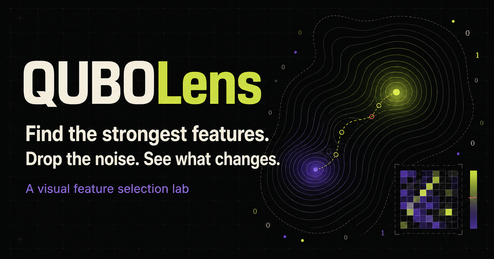

# QUBOLens

### Find the strongest features. Drop the noise. See what changes.

QUBOLens is an interactive feature-selection lab. Give it a dataset, choose how
many inputs you want to keep, and it finds a compact feature set without
rewarding repeated information.



[](https://render.com/deploy?repo=https://github.com/RS-010806/quantum)

[Two-page project brief](output/pdf/QUBOLens-Project-Brief.pdf) ·
[Technical guide](docs/TECHNICAL_GUIDE.md) ·
[MIT license](LICENSE)

## What you can do

- Upload your own dataset first, or use a complete sample to learn the flow.
- Upload CSV, TSV, delimited text, JSON, JSONL, or XLSX data.
- Preview the original rows and the model-ready inputs before running anything.
- Download every row of either sample dataset as CSV.
- Choose exactly how many features to keep.
- Compare the chosen set with a simple ranking and the full dataset.
- See each chosen input, its connection to the target, and its overlap with the
  rest of the set.
- Open the optional settings and technical charts only when you need them.
- Download the complete result or its reusable optimization matrix.

Uploads are processed in memory and are not saved by the application.

## Why it is interesting

A feature can look useful on its own while adding almost nothing beside another
feature. QUBOLens evaluates usefulness and overlap together, then shows the
trade-off instead of hiding it behind a single score.

The quantum-computing connection is the way this choice is written: the
selection becomes a QUBO problem, a format used by quantum and other
optimization methods. The practical lesson is that a quantum idea can improve
how a problem is framed before new hardware is involved.

## Run locally

You need Python 3.11 or newer. There are no packages to install.

### macOS or Linux

```bash
git clone https://github.com/RS-010806/quantum.git
cd quantum
python3 -m qubolens.server
```

### Windows PowerShell

```powershell
git clone https://github.com/RS-010806/quantum.git
cd quantum
py -m qubolens.server
```

Open [http://localhost:8000](http://localhost:8000). The lab waits for you to
upload a file or choose a sample; no result runs automatically. Press `Ctrl+C`
in the terminal to stop the app.

If port `8000` is already in use:

```bash
PORT=8080 python3 -m qubolens.server
```

On PowerShell:

```powershell
$env:PORT=8080
py -m qubolens.server
```

Then open [http://localhost:8080](http://localhost:8080).

## Use the guided examples

1. Scroll to **Just exploring?** and choose the device-failure or cloud-cost
   sample.
2. Inspect the row preview, source-column count, and prepared input names.
   Select **Download all rows** if you want the complete CSV.
3. Use the slider to choose how many inputs you want to keep. Six is a useful
   starting point.
4. Select **Show me the best inputs**. The result area appears only now.
5. Read the answer, score comparisons, QUBO checks, and chosen inputs from top
   to bottom.
6. Open **Explore how the result was found** only if you want the search charts
   or reusable matrix.

For a yes-or-no prediction, the app reports ROC AUC: `0.50` is random ordering
and `1.00` is perfect ordering. For a numeric prediction, it reports R²: `0.00`
matches always predicting the average and `1.00` is perfect.

## Use your own data

In the web app:

1. Select **Choose a data file** at the top of the lab.
2. Confirm the detected rows and choose the column you want to predict.
3. Review the raw preview and the model-ready input names.
4. Set the number of prepared inputs to keep.
5. Select **Analyze the best inputs**.

The first row of a delimited file, or the keys in a JSON record, must contain
column names. Each later row or record should be one observation. Include one
target column containing the outcome or number to predict.

Upload support:

- CSV, TSV, comma/tab/semicolon/pipe-delimited text, JSON, JSONL, and XLSX
- files up to 20 MB
- at least 30 rows with a prediction target
- up to 100 source columns and 40 prepared inputs
- numeric, date, categorical, and free-text input values
- a two-class or numeric target

Large files are accepted and analyzed through a repeatable sample of up to 5,000
rows so the interactive run remains responsive. Numbers are median-filled,
dates become time values, categories become indicator columns, and free text
becomes transparent length, word-count, vocabulary, digit, and common-keyword
measures. Likely identifier columns are skipped.

## Command line

Run an included example:

```bash
python3 -m qubolens --demo edge-failure -k 6 --quality fast
```

Run any supported data file and save the result:

```bash
python3 -m qubolens --file measurements.xlsx --target outcome -k 8 \
  --quality balanced --output result.json
```

## Deploy on Render

The repository already contains the Render configuration.

### One-click deployment

1. Click **Deploy to Render** near the top of this page.
2. Sign in to Render and connect GitHub if asked.
3. Review the `qubolens` web service.
4. Click **Deploy Blueprint**.
5. Open the `.onrender.com` address shown when deployment finishes.

### From the Render dashboard

1. Open the Render dashboard and select **New → Blueprint**.
2. Connect `RS-010806/quantum`.
3. Keep the branch set to `main`.
4. Confirm that the Blueprint path is `render.yaml`.
5. Review the service and select **Deploy Blueprint**.

No environment variables, database, or manual build settings are required.
Render reads them from [`render.yaml`](render.yaml). Automatic deployments are
off by default for people deploying from the public repository; they can be
enabled later from the service settings.

## Repository structure

| Path | Purpose |
|---|---|
| `qubolens/web/` | Responsive interface, animations, and charts |
| `qubolens/server.py` | Web server and JSON endpoints |
| `qubolens/pipeline.py` | Runs selection, comparison, and result creation |
| `qubolens/core.py` | Builds and searches the feature-selection problem |
| `qubolens/data.py` | Example datasets, file parsing, and data preparation |
| `qubolens/evaluate.py` | Uses the same model checks for every feature set |
| `tests/` | Unit and end-to-end tests |
| `docs/` | Project brief and technical explanation |
| `render.yaml` | One-service Render deployment |

## Check the project

```bash
python3 -m unittest discover -s tests -v
python3 -m compileall -q qubolens
```

The tests cover selection math, repeatable results, delimited text, JSONL,
XLSX, large-file sampling, feature limits, and the complete result format.

## Research basis

QUBOLens is informed by:

- Mücke et al.,
  [*Feature Selection on Quantum Computers*](https://doi.org/10.1007/s42484-023-00099-z)
- Glover, Kochenberger, and Du,
  [*A Tutorial on Formulating and Using QUBO Models*](https://arxiv.org/abs/1811.11538)
- Pranjic, Mummaneni, and Tutschku,
  [*Quantum Annealing based Feature Selection in Machine Learning*](https://arxiv.org/abs/2411.19609)
- Hellstern, Dehn, and Zaefferer,
  [*Quantum computer based Feature Selection in Machine Learning*](https://arxiv.org/abs/2306.10591)

## Important limits

- Treat the scores as a way to explore a direction, not as final production
  validation.
- Correlation does not capture every nonlinear relationship.
- Text support uses transparent structural and keyword measures, not language
  embeddings.
- Test the selected features on data that was not used during selection.
- The included search runs without quantum hardware; the QUBO can be exported
  for other compatible methods.

## License

QUBOLens is available under the [MIT License](LICENSE).
